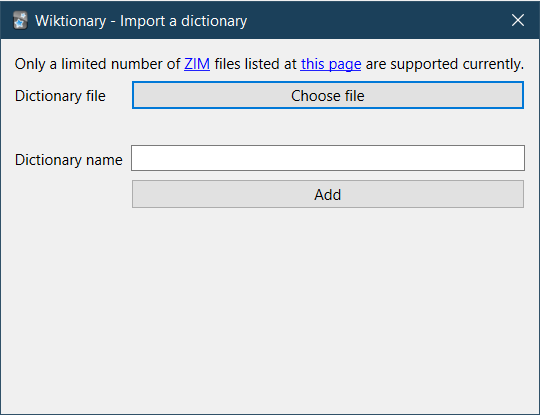
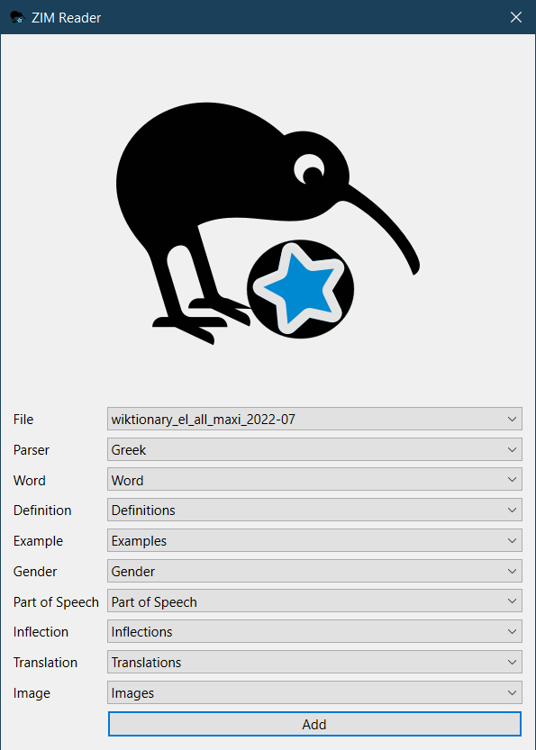
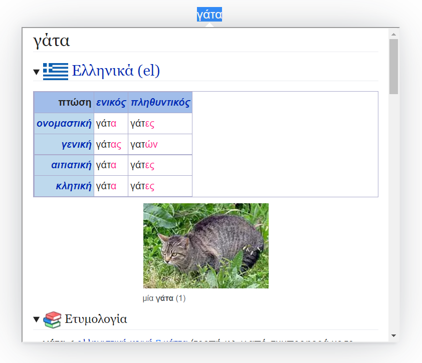
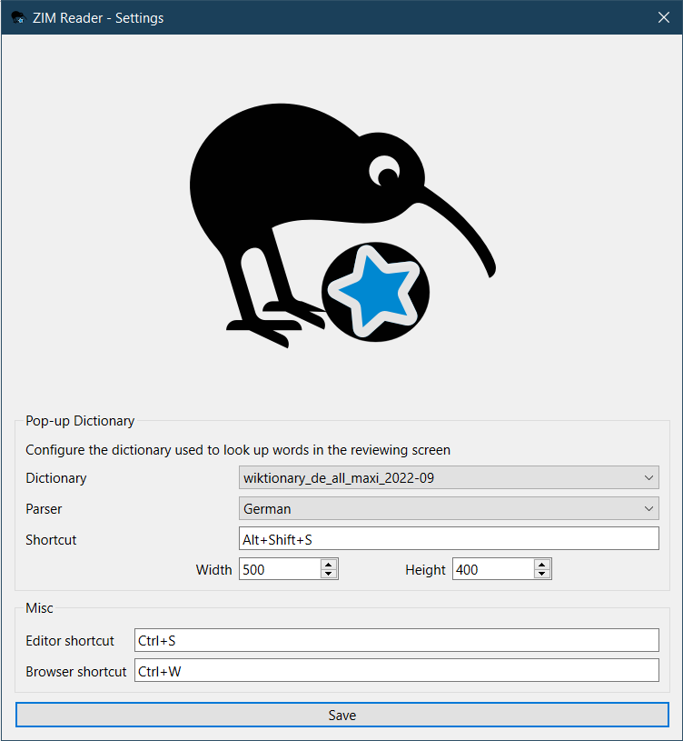

Anki add-on that allows you to import [ZIM](<https://en.wikipedia.org/wiki/ZIM_(file_format)>) files
and access their data inside Anki. The main focus of the add-on is to support extracting information such word definitions, example sentences, pronunciation, etc. from the Wiktionary ZIM files and add them to notes.

This is a fork of the [Wiktionary](https://github.com/abdnh/anki-wiktionary) add-on. The plan was to add ZIM support to the Wiktionary add-on in addition to the original support for Kaikki files, but I got some ideas to extend the add-on with ZIM-specific additions like a pop-up dictionary and a local server that can be accessed from other add-ons, so I decided to split it into a new add-on to keep the Wiktionary add-on simple.

## Supported dictionaries

Currently supported Wiktionary versions are the following:

- Greek
- Spanish
- German
- Turkish

We try to support the ZIM files provided by the [Kiwix](https://www.kiwix.org/) team at https://wiki.kiwix.org/wiki/Content_in_all_languages

If you want to see support for your language, you can open a feature request in the [issue tracker](https://github.com/abdnh/anki-zim-reader/issues).
If you're a developer and want to contribute, please see [development.md](./development.md).

## Usage

### Importing a ZIM file

The dialog under _Tools > ZIM Reader > Import a file_ allows you to import a new ZIM file and make it available for use in the add-on. [The Kiwix library](https://library.kiwix.org/) has a lot of ZIM files available for download.

### Filling in notes

The add-on provides an interface to fill existing notes with defintions, example sentences, etc. from imported files.
The interface can either be accessed from a button in the editor, or via the _Edit > Bulk-define from ZIM file_ menu
item in the browser for bulk operations on selected notes. You can also configure shortcuts from _Tools > Add-ons_.

Explanation of some options:

- **File**: The imported ZIM file you want to extract info from.
- **Parser**: For the add-on to understand how to extract data from the chosen file, you need to tell it what "parser" it should use to do that. Only a limited number of ZIM files for a couple of languages currently have parsers.
- **Word**: The field where the word you want to query exists.
- The other options decide to which field each kind of supported info goes.

### Pop-up dictionary

There is also a feature to look up words in the reviewing screen in imported ZIM files.
Unlike the "fill-in" feature, this should work on any imported ZIM file without the need for a special parser.
If you select any word and press "Alt+Shift+S", a pop-up should be shown with the page of the selected word if found.
You can configure the ZIM file used for the pop-up feature and some other settings from the [Settings](#settings) dialog.

### Settings

You can configure some settings of the add-on from _Tools > ZIM Reader > Settings_.
Currently only the pop-up dictionary's settings are configurable here.
For the parser option, if your chosen dictionary file doesn't have a dedicated parser, you can simply choose the "Default" parser. Parsers here are currently only useful to convert a word to its base form and search for that instead using language-specific rules if the exact word doesn't have a page in the dictionary.

## Download

You can download the add-on from AnkiWeb: https://ankiweb.net/shared/info/951350249

Also see [development.md](./development.md#building-the-add-on) if you want to get the most recent version from the last commit.

## Development

See [development.md](./development.md) for docs that only interest developers and contributors.

## License

GPLv3 or later. See [LICENSE](./LICENSE).

## Credit

- The logo is adapted from the [Kiwix logo](https://en.wikipedia.org/wiki/File:Kiwix_logo_v3.svg) (licensed under the [CC BY-SA 4.0](https://creativecommons.org/licenses/by-sa/4.0/deed.en)) and the Anki logo from the [Papirus icon theme](https://github.com/PapirusDevelopmentTeam/papirus-icon-theme) (licensed under the [GPLv3](https://github.com/PapirusDevelopmentTeam/papirus-icon-theme/blob/master/LICENSE)).

## Support

This add-on is experimental. I appreciate bug reports and suggestions. Please use the issue tracker on [GitHub](https://github.com/abdnh/anki-zim-reader/issues) or post in the [this Anki Forums thread](https://forums.ankiweb.net/t/zim-reader-for-anki/23669).

## Support & feature requests

Please post any questions, bug reports, or feature requests in the [support page](https://forums.ankiweb.net/t/zim-reader-for-anki/23669) or the [issue tracker](https://github.com/abdnh/anki-zim-reader/issues).

If you want priority support for your feature/help request, I'm available for hire.
You can get in touch from the aforementioned pages, via [email](mailto:abdo@abdnh.net) or on [Fiverr](https://www.fiverr.com/abd_nh).

## Support me

Consider supporting me if you like my work:

I'm also available for freelance add-on development on Fiverr:

